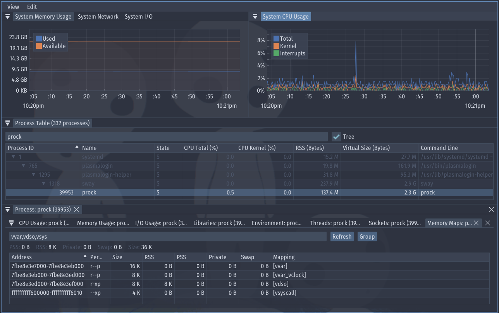

# Prock - Process Explorer for Linux

The tool is still in development. I'm improving my Linux desktop experience.



*My configuration: FiraSansCondensed font, Nord theme, 74% Opacity.*

## Features

### Process Monitoring
- Tree view (default) or flat list showing parent-child relationships
- Filter by name (Ctrl+F) or type to jump to a process
- Press 'Space' to toggle "Auto-Follow" on all charts
- Sortable and reorderable columns
- Copy process info or entire table to clipboard
- Kill (SIGTERM), force kill (SIGKILL), or kill entire process tree
- Suspend / resume processes
- Set CPU affinity and nice priority

### System Charts
- CPU usage (total, kernel, interrupts) with optional per-core and stacked views
- Memory usage (used vs available)
- Disk I/O throughput (read/write MB/s)
- Network throughput (send/receive MB/s)

### Per-Process Details
- Right-click any process to open:
  - Dedicated charts (CPU, memory, I/O, network)
  - Loaded libraries with mapped/file sizes
  - Memory maps with address, permissions, RSS/PSS/swap, and grouping by mapping
  - Sockets
  - Threads
  - Environment variables
- Double-click to open all windows at once

## Runtime Dependencies

The released `prock` binary targets glibc 2.17+, so it runs on most Linux distros.
It dynamically loads the libraries below, which are already present on a standard desktop install:
- **glibc 2.17+** — `libc`, `libm`, `libpthread`, `libdl`
- **OpenGL ES 2.0 + EGL** — `libGLESv2.so.2`, `libEGL.so.1`
- **FreeType** — `libfreetype.so.6`
- **A display backend**, one of:
  - **X11** — `libX11.so.6` `libXcursor`, `libXi`, `libXrandr`, `libXinerama`
  - **Wayland** — `libwayland-client.so.0`, `libwayland-cursor.so.0`, `libwayland-egl.so.1`, `libxkbcommon.so.0`

On a minimal or headless system, install them explicitly:

**Debian/Ubuntu:**
```bash
sudo apt install libgles2 libegl1 libfreetype6 libx11-6 libxcursor1 libxi6 libxrandr2 libxinerama1 libwayland-client0 libwayland-cursor0 libwayland-egl1 libxkbcommon0
```

**Arch Linux:**
```bash
sudo pacman -S mesa libglvnd freetype2 libx11 libxcursor libxi libxrandr libxinerama wayland libxkbcommon
```

## Building

### Dependencies

**Debian/Ubuntu:**
```bash
sudo apt install cmake gcc libwayland-dev libxkbcommon-dev xorg-dev libgles2-mesa-dev libfreetype-dev
```

**Arch Linux:**
```bash
sudo pacman -Sy cmake gcc freetype2
```

### Install & Update

Install:
```bash
git clone https://github.com/matrohin/prock.git
cd prock

./scripts/install.sh
```

Update:
```bash
cd prock

./scripts/update.sh
```

### Debug build & Run

```bash
cmake --preset debug
./scripts/build.sh
./build/Debug/prock
```
